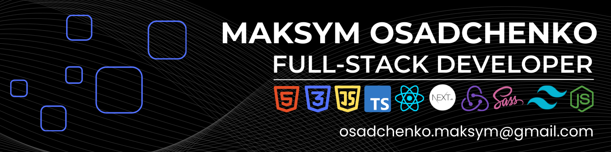

<h1 align="center">Hi there, I'm <a href="[https://daniilshat.ru/](https://www.linkedin.com/in/maksym-osadchenko/)" target="_blank">Maksym</a> 
</h1>

I am a front-end developer. As for my skills, I know HTML, CSS, JS, TS, React, Redux.
I am currently studying Node.js.
I have been coding for 8 months and during this time I have done 2 successful team projects and 5 individual ones.
I have good computer skills and quickly learn how to work with various programs.
I like to do my job well and learn new skills quickly.
I always try to optimize my work to be more efficient.
I strive to achieve good positions in the company to increase the pace of production and growth of the organization, as well as for personal career growth.

<h2>Contact Information:</h2>

<h2>Tech Skills:</h2>

<table>
  <tr>
    <td></td>
    <td></td>
    <td></td>
    <td></td>
    <td></td>
    <td></td>
    <td></td>
    <td></td>
  </tr>
</table>
